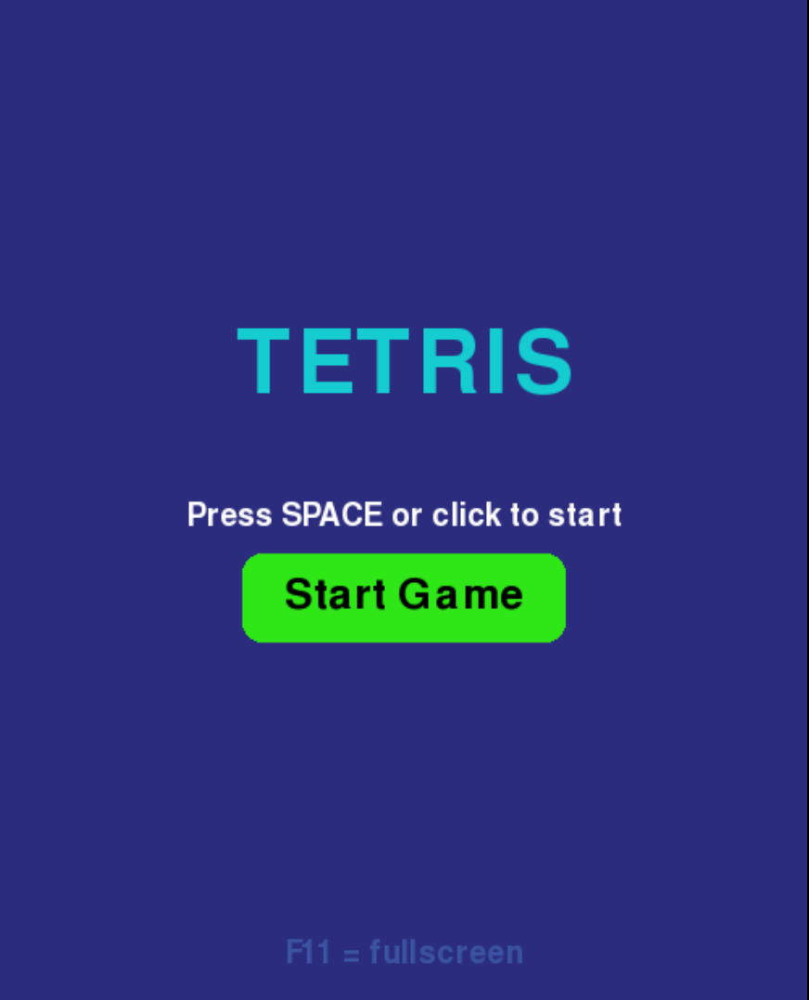
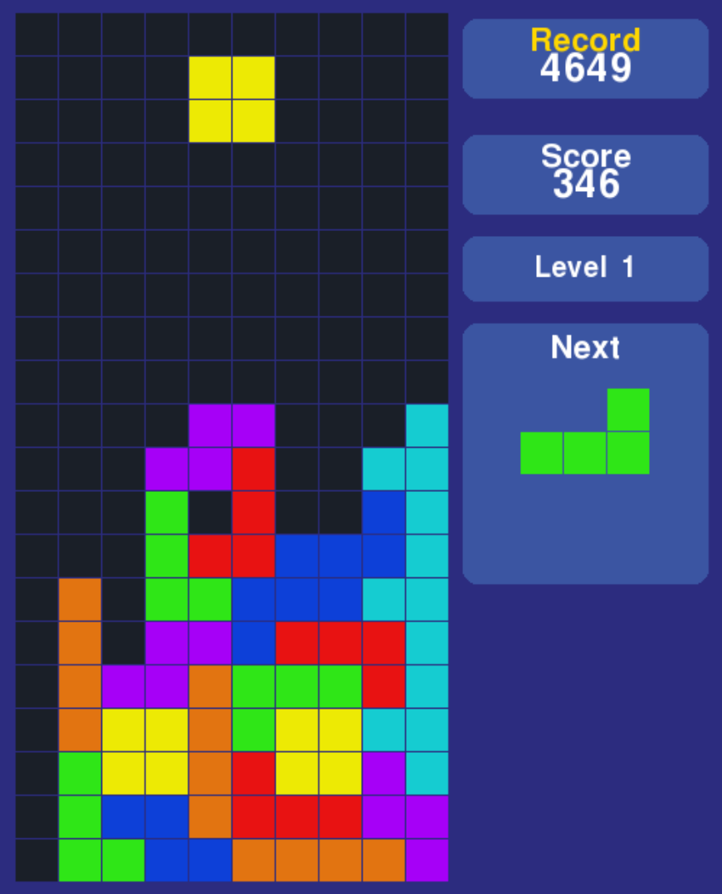
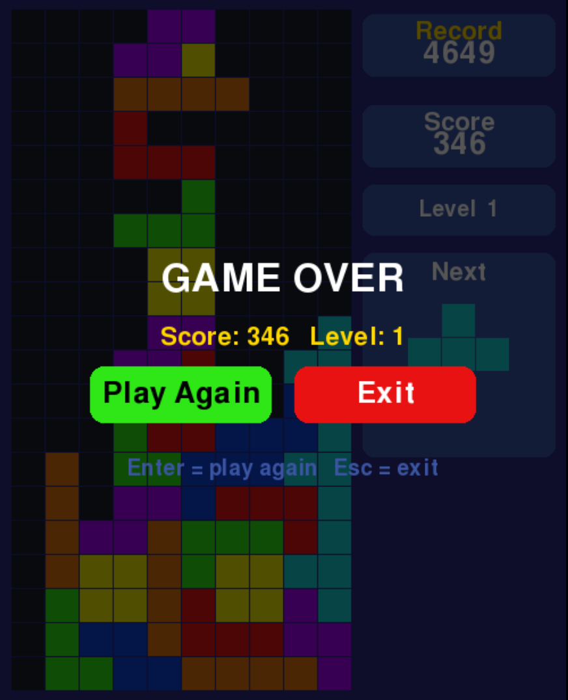

# 🎮 Python Tetris

A Tetris clone built with Python and Pygame.


## 🎥 Demo


## 📸 Screenshots

### Main Menu



### Gameplay



### Game Over



---

# English

## Features

* Classic Tetris gameplay
* Score system
* Level progression
* Hard Drop
* Next Piece preview
* Pause menu
* Persistent high score
* Sound effects and background music
* Fullscreen support (F11)
* Keyboard support with Arrow Keys and WASD

## Requirements

* Python 3.8+
* Pygame CE

## Installation

Clone the repository:

```bash
git clone https://github.com/guilhermededeus/python-tetris.git
cd python-tetris
```

Create and activate a virtual environment:

```bash
python3 -m venv venv
source venv/bin/activate
```

Install dependencies:

```bash
pip install -r requirements.txt
```

## Running the Game

```bash
python3 main.py
```

## Controls

| Action     | Keys          |
| ---------- | ------------- |
| Move Left  | ← / A         |
| Move Right | → / D         |
| Soft Drop  | ↓ / S         |
| Rotate     | ↑ / W / Space |
| Hard Drop  | Shift         |
| Pause      | Esc           |
| Fullscreen | F11           |

## Technologies

* Python
* Pygame CE
* Linux

## License

Created for learning purposes.

---

# Português (Brasil)

## Funcionalidades

* Jogabilidade clássica do Tetris
* Sistema de pontuação
* Progressão de níveis
* Hard Drop
* Visualização da próxima peça
* Menu de pausa
* Recorde persistente
* Efeitos sonoros e música de fundo
* Suporte a tela cheia (F11)
* Suporte aos controles por Setas e WASD

## Requisitos

* Python 3.8+
* Pygame CE

## Instalação

Clone o repositório:

```bash
git clone https://github.com/guilhermededeus/python-tetris.git
cd python-tetris
```

Crie e ative um ambiente virtual:

```bash
python3 -m venv venv
source venv/bin/activate
```

Instale as dependências:

```bash
pip install -r requirements.txt
```

## Executando

```bash
python3 main.py
```

## Controles

| Ação                  | Teclas         |
| --------------------- | -------------- |
| Mover para a esquerda | ← / A          |
| Mover para a direita  | → / D          |
| Acelerar queda        | ↓ / S          |
| Girar peça            | ↑ / W / Espaço |
| Hard Drop             | Shift          |
| Pausar                | Esc            |
| Tela cheia            | F11            |

## Tecnologias

* Python
* Pygame CE
* Linux

## Licença

Projeto desenvolvido para fins de estudo.
